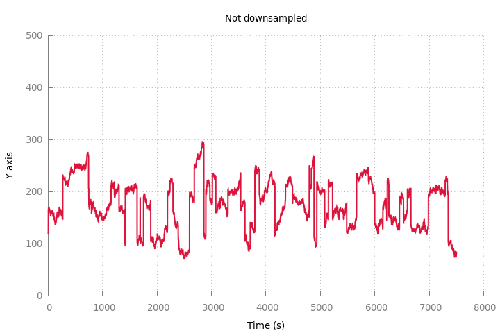
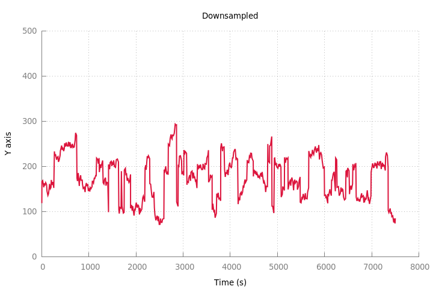

# Largest-Triangle-Three-Buckets (Python)
This is an implementation of the Largest-Triangle-Three-Buckets (LTTB) downsampling algorithm in Python.

The code has been translated from the work of Sveinn Steinarsson in his plugin for Flot charts.  
More information is available on [his page](https://github.com/sveinn-steinarsson/flot-downsample/),
and you can find the thesis describing the algorithm [here](http://skemman.is/handle/1946/15343).

### Demo
The first chart contains 7500 points, and the downsampled one 500 points :  
  
  

### Usage
* Include `lttb.py` into your project and call the function there
* You can use run.sh to generate and produce the demo graph

